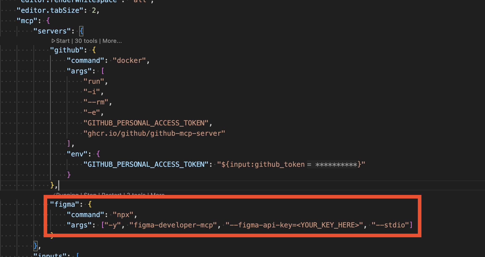
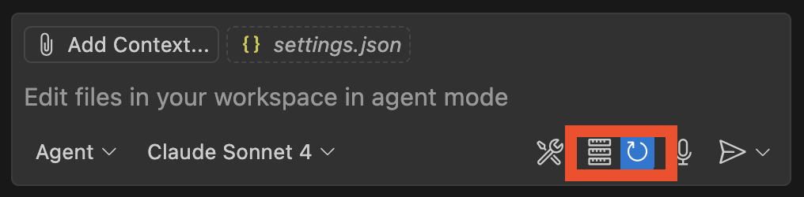

# website-design-with-MCP

This is a repo that showcases how you can go from a plain text webpage to a professionally designed webpage using Copilot agent mode and the [Figma MCP Server](https://github.com/GLips/Figma-Context-MCP). This is similar to the steps demonstrated in [this keynote demo](https://www.youtube.com/watch?v=sT_Xm08ghcU) from MSFT Build 2025.

## Steps

### [ONE TIME SETUP] Install the MCP Server
1. As a one time setup, you will need the [Figma MCP Server](https://github.com/GLips/Figma-Context-MCP) installed in VS Code to be able to complete this demo.
   1. To do this, add the appropriate config from the [Figma MCP server's README](https://github.com/GLips/Figma-Context-MCP?tab=readme-ov-file#getting-started) to your User `settings.json` file in VS Code.
      1. TIP: Using "Ask" mode, ask Copilot `@vscode where is the User settings.json file?`
   1. You will also need to create a PAT in Figma with the appropriate permissions to be included in the config
   1. Example: 
1. Once installed / configured, you will need to restart the MCP config for VS Code in the agent mode window.
   1. Example: 

### Create a design in Figma
1. Log into Figma and copy the link to an existing Figma design or create a new design and copy the link.

### Use Agent Mode
1. Ask Copilot agent mode to "Could you please look at what I have selected in Figma, and use that to generate code and then apply the code to my website so my website's design and content looks exactly like my Figma design?" and be sure to include the URL to your design in your prompt.

And voila! You'd Figma design has been applied to the basic HTML text webpage in this repo!

## Notes

### How to run
1. To run the webpage at any point, run the `npm start` command